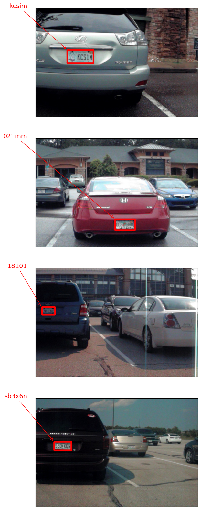

# OCR_finetuning
## 자동차 번호판 인식을 위한 OCR finetuning

Using keras-ocr,
I finetuned the detector model and recognizer model.

- Detector model finds the area of the car license plate.
- Recognizer model finds the appropriate letters or numbers in license plate.

### Below is the result of inference.

